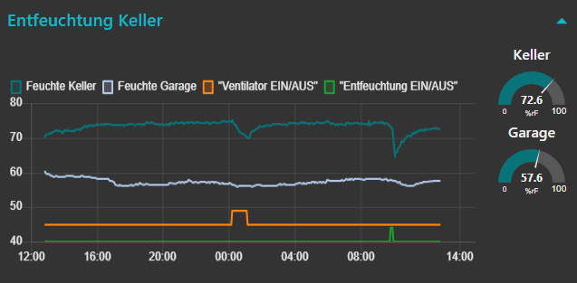
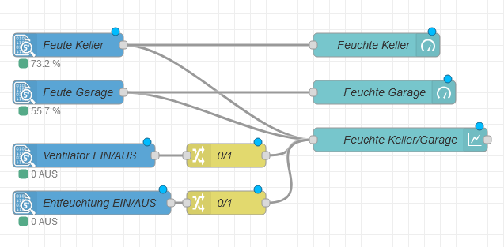
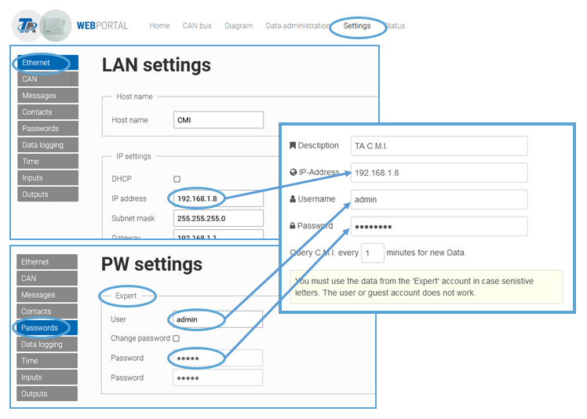

[](https://nodered.org)
[](https://www.npmjs.com/package/node-red-contrib-ta-cmi)
[](https://www.npmjs.com/package/node-red-contrib-ta-cmi)
[](https://github.com/peteraustria/node-red-contrib-ta-cmi/commits/master)
[](https://github.com/vivereSmartGroup/node-red-contrib-ta-cmi/master/LICENSE)
[](https://www.paypal.com/donate?business=RXENQEUPYFL2Y&no_recurring=1&currency_code=EUR)
[](https://github.com/peteraustria/node-red-contrib-ta-cmi)

# node-red-contrib-ta-cmi


The **C**ontrol and **M**onitoring **I**nterface (**C.M.I.**) is an interface for convenient system monitoring, remote control and data logging of all controllers with DL or CAN bus form [Technische Alternative RT GmbH, Austria](https://www.ta.co.at/en/ "Webpage of Technische Alternative RT GmbH").

This node can be configured to query the [C.M.I.](https://www.ta.co.at/en/x2-operation-interfaces/cmi/ "C.M.I. product page") at configurable intervals and provide any value from any node on the TA bus as its output. So it is easy to access, display and visualize Data that is coming from e.g. the [UVR16x2 programmable universal controler](https://www.ta.co.at/en/x2-freely-programmable-controllers/uvr16x2/ "UVR16x2 product page") UVR16x2 programmable universal controler with Node-RED.
This node is multilingual (currently German and Englisch) depending on the selected system language of Node-RED. 


## Quick Start

Install from your <b>Node-RED Manage Palette</b> or using npm:
```
npm install node-red-contrib-ta-cmi
```
## Example





```
[{"id":"8ca1c094.c35c68","type":"cmi in","z":"7ef2298e.f66cf","cmi":"244863cc.935f84","name":"Feuchte Keller","item":"23","source":"0","timestamp":"1","skip":"0","severity":"0","x":180,"y":120,"wires":[["30c4ce5f.62087a","88b49ced.a1c3e"]]},{"id":"261f918e.49207e","type":"cmi in","z":"7ef2298e.f66cf","cmi":"244863cc.935f84","name":"Feuchte Garage","item":"24","source":"0","timestamp":"1","skip":"0","severity":"0","x":180,"y":180,"wires":[["2f87374f.367ba","88b49ced.a1c3e"]]},{"id":"10312ce.c52ab53","type":"cmi in","z":"7ef2298e.f66cf","cmi":"244863cc.935f84","name":"Ventilator EIN/AUS","item":"21","source":"1","timestamp":"1","skip":"0","severity":"0","x":190,"y":260,"wires":[["2fcc655c.f0ac02"]]},{"id":"1208a86d.6bd66","type":"cmi in","z":"7ef2298e.f66cf","cmi":"244863cc.935f84","name":"Entfeuchtung EIN/AUS","item":"22","source":"1","timestamp":"1","skip":"0","severity":"0","x":200,"y":320,"wires":[["573c0851.6ffff"]]},{"id":"88b49ced.a1c3e","type":"ui_chart","z":"7ef2298e.f66cf","name":"Feuchte Keller/Garage","group":"88a17a33.f3f398","order":1,"width":"10","height":"6","label":"","chartType":"line","legend":"true","xformat":"HH:mm","interpolate":"linear","nodata":"","dot":false,"ymin":"40","ymax":"","removeOlder":"24","removeOlderPoints":"","removeOlderUnit":"3600","cutout":0,"useOneColor":false,"useUTC":false,"colors":["#097479","#aec7e8","#ff810f","#2ca02c","#98df8a","#d62728","#ff9896","#9467bd","#c5b0d5"],"outputs":1,"useDifferentColor":false,"x":610,"y":240,"wires":[[]]},{"id":"30c4ce5f.62087a","type":"ui_gauge","z":"7ef2298e.f66cf","name":"Feuchte Keller","group":"88a17a33.f3f398","order":2,"width":"2","height":"2","gtype":"gage","title":"Keller","label":"%rF","format":"{{value}}","min":"0","max":"100","colors":["#ff0000","#097479","#ff0000"],"seg1":"50","seg2":"75","x":580,"y":120,"wires":[]},{"id":"2f87374f.367ba","type":"ui_gauge","z":"7ef2298e.f66cf","name":"Feuchte Garage","group":"88a17a33.f3f398","order":3,"width":"2","height":"2","gtype":"gage","title":"Garage","label":"%rF","format":"{{value}}","min":"0","max":"100","colors":["#ff0000","#097479","#ff0000"],"seg1":"50","seg2":"75","x":590,"y":180,"wires":[]},{"id":"2fcc655c.f0ac02","type":"change","z":"7ef2298e.f66cf","name":"0/1","rules":[{"t":"change","p":"payload","pt":"msg","from":"1","fromt":"num","to":"49","tot":"num"},{"t":"change","p":"payload","pt":"msg","from":"0","fromt":"num","to":"45","tot":"num"}],"action":"","property":"","from":"","to":"","reg":false,"x":390,"y":260,"wires":[["88b49ced.a1c3e"]]},{"id":"573c0851.6ffff","type":"change","z":"7ef2298e.f66cf","name":"0/1","rules":[{"t":"change","p":"payload","pt":"msg","from":"1","fromt":"num","to":"44","tot":"num"},{"t":"change","p":"payload","pt":"msg","from":"0","fromt":"num","to":"40","tot":"num"}],"action":"","property":"","from":"","to":"","reg":false,"x":390,"y":320,"wires":[["88b49ced.a1c3e"]]},{"id":"244863cc.935f84","type":"cmi config","description":"TA C.M.I.","ip":"192.168.1.8","canNode":"10","interval":"1"},{"id":"88a17a33.f3f398","type":"ui_group","name":"Entfeuchtung Keller","tab":"18886b9.a624594","order":9,"disp":true,"width":"12","collapse":true},{"id":"18886b9.a624594","type":"ui_tab","name":"Keller / Garage","icon":"exposure_neg_1","order":3,"disabled":false,"hidden":false}]
```


## Configuration

### One-time Settings
In the "Edit cmi node" properties page klick the little pencil icon and Node-RED will show up the **ADD NEW CMI CONFIG NODE**. Here you fill in the requested information as follows:



**Note:** For each combination of a CAN-Device and C.M.i. in your CAN-network you have to configure this **only once**.
When done, plase click the "Add" button and Node-RED will return you to the **EDIT CMI IN NODE**.
Starting from version 1.0.10 of this node it is possible to query more than one CAN-Device with just one C.M.I. For details have a look at the help page in the flow editor of Node-RED. 

### Settings for each node
You can place as many cmi-in nodes in your flows as you like. From the dropdown select the same C.M.I. for each node (e.g. the default "TA C.M.I.").


Since version 0.1.2 of the node, you can additionally configure that the node skips a number of duplicate values to reduce the amount of data that is sent out by the node. For analog data you can also configure a tolerance in percent within which a value is treated as identical, despite a (small) deviation and is therefore not output.

## What else...

### Responsibility

This node was developed by me privately, in my spare time and it is expressly **NOT a product of Technische Alternative RT GmbH**. The company Technische Alternative RT GmbH is therefore neither responsible for the function nor for the support of this node. The author provides the code for free on GitHub "as it is" and also assumes no liability for any inconvenience or damage that may 
result from its use. 

If you like this node and you want it to be supported and improved in future, you could buy me a drink to motivate me to continue adding new features in the future and to maintain the program.

[](https://www.paypal.com/donate?business=RXENQEUPYFL2Y&no_recurring=1&currency_code=EUR "Thank you!")

### BETA stage

The node has been extensively tested on my system, and it works with the hardware and configuration I am using. But I also got positive response form some others who use it. If you find any bugs or you need a new feature, please drop me a note at <a href="https://github.com/PeterAustria/node-red-contrib-ta-cmi/issues">GitHub</a>.

### Language support

This node is autodetecting the langeuage of your Node-RED installation. Currently it supports Germand and Englisch (other language installs will be displayed in Englisch as well). If you like support for other languages and/or you are willing to help with a translation, please also drop me a note at <a href="https://github.com/PeterAustria/node-red-contrib-ta-cmi/issues">GitHub</a>.

## Changelog

#### 0.1.0 Initial version 2021-10-22

#### 0.1.1 Minor changes in documentation 2021-10-22

#### 0.1.2 New features added, and bugs fixed 2021-10-28
- **Feature added to skip duplicate values.** It is now possible not to output repetitive values ​​every time, but only after x repetitions of the same value, but immediately when the value is changed. This can be useful, for example, if you want to display the values ​​in a chart node. Because a very high number of values ​​in a chart node significantly reduces performance. If the value is an analog value, you can also set a tolerance in percent within which a value is treated as identical despite a (small) deviation and is therefore not output.
- **Corrected request time.** In the initial release the node requested data from the C.M.I. twice as often as configured.
- **removed 'part'** in the message object of digital logging data.
- **added up/down buttons** for numeric inputs.

#### 0.1.3 Minor changes 2021-10-29
- Some **spelling mistakes** corrected in the dialogs and also in the help texts.
- For new nodes, the **default value for 'UI shows ... below the node'** set to **'Value and unit only'** as specified in the documentation.
- For new nodes, the **default value for 'Source'** is changed to **'Datalogging Analog'**; this setting is usually used more often.
- Removed **"debug": "^4.3.1"** as a dependency for the node.

#### 0.1.4 Timestamp 2021-10-31
- The output message of the node includes as `msg.timestamp` which comes form the C.M.I. and is a Unix timestamp in seconds. But Node-RED uses the JavaScript timestmap which is in Milliseconds. To get a valid JS Timestamp, the timestamp coming from the C.M.I. is now multiplied by 1000 so it can be used correctly by other nodes (like e.g. the chart-node).

#### 0.1.5 Timestamp removed from output 2021-11-01
- The daylight change led to a problem with the time stamp. It seems that the 'chat node' has an undocumented function: it accepts a `msg.timestamp` and uses this as the point in time for the diagram. Unfortunately, the conversion to summer / winter time is not correct. To avoid this, this property has been removed.
- Added UTC-conversion for all date / time fields.
 
#### 0.1.6 New sources added 2021-11-02
- Node documentation updated
- Added Input and Output Sources

#### 0.1.7 Option to select the Node number on the CAN-Bus added 2021-12-17
- Up to version 0.1.6 all Data was read from CAN Device #1. With version 0.1.7 an option was added, that let you **specify** from which **device on the CAN-Bus** the data should be read.
- Further **translations** were done. The whole node is now available in englisch and german language. The language is automaitically selected acording the Node-RED system settings 
- Better Status code checking and evaluation of C.M.I. return codes.

#### 0.1.8 Fixed issue with undefined variable

#### 0.1.9 Digital and analog network inputs added
- Digital and analog network inputs for the UVR1611 were added.
- Help text for the info tab enhanced
- Language translations in the UI improved

#### 0.1.10 One C.M.I. and more CAN-Devices
- Support for querying more than one CAN-Device with one C.M.I. added. Please see the help page in the flow editor of Node-RED or the FAQ. 
- Fixed a possible crash when you enter an IP-Address of another device (not the C.M.I) which also answers with an http-reply but in a wrong format.
- Fixed pharsing problem.
- Updated help text and translations.

#### 0.1.11 Fixed problem with incorrect element numbers and added DL-Bus devices
- Fixed a problem when numbering of the elements in the device is not consecutive. (Many thanks to [Alexander Halbarth]("https://github.com/alexhalbi" "Githum of Alexander Halbarth") for finding and fixing this issue.)
- Added DL-Bus devices (e.g. room sensors) 

#### 0.1.12 Added Timestamp to the node output
- An additional field was added in the output of the node, which contains the system time when the message was created. This uses the system time of the C.M.I. from which the data was read, not the time of the NodeRed installation.
- A problem was fixed that the time before the node reads the first value from the C.M.I. increased with every deployment. This probem was firest seen in Version 0.1.10.

## FAQ

#### After redeploying, the node desplays `too many requests to C.M.I. (max 1 per min allowed)`.

The C.M.I. allows a maximum of one query per minute. This is a requirement by Technische Alternative RT GmbH and not by this node.
Through the redeploy, the node is restarted. It immediately tries to access the C.M.I. and read out the latest data. If the last access was not at least 60 seconds ago, this error message is displayed. After the period of time specified in the configuration (at least one minute later), the node again tries to read the data from the C.M.I. Latest now, this should work successfully. If not, please check whether the node is really only configured once. Even if you want to read out multiple values you must configure the C.M.I. only once (click the little pencil-icon only in the first node you add). If you re-use the node, just open the dropdown and select the already configured C.M.I. 
For querying more devices with one C.M.I. plase have a look at the help text in the node or the FAQ "How can I configure the node to query more than one device on the CAN-Bus with one C.M.I." below.


#### The user credentials in the configuration of the node are correct, but the node still displays `wrong user or password`.

You **must** use the credentials of an **"expert"** user. A normal user or guest does not work. 
This is a requirement by Technische Alternative RT GmbH and not by the node.


#### Error message `HTTP call and Answer from CMI successful but Node not configured correctly. : Cannot read property '0' of undefined` displayed.

Make sure, that the requested 'Element No.' is included in the Datalogging and Datalogging is configured in the CMI. Probably you addressed an 'Element No.' which is not included in the data coming from C.M.I., or the C.M.I. is configured in a wrong way.

#### How can I access a device with an `other CAN-Bus-Node-Number than 1`?

With **version 0.1.7** an new option was added to the configuration of the node that allows the node to read data form other devices on the CAN-Bus as well. CAN-Bus number 1 stays as the default.

#### How can I configure the node to query `more than one device on the CAN-Bus with one C.M.I.`?

Starting with **version 0.1.10** of this node it is possible to configure more than one CMI-Configurations and query different devices through one C.M.I. 
For expample we have an UVR16x2, a RMS610 and one C.M.I. in our network.
1) First we configure the UVR16x2 by clicking the little pencil icon in the **EDIT CMI IN NODE** properties dialog. The properties dialog of **EDIT CMI CONFIG NODE** will open. 
2) Here we configure the C.M.I. using a meaningful description (e.g. "UVR16x2") and in the accociated field we enter the CAN-number of the device. 
3) Because we want to query two devices and TA supports only one request per minute, we enter **2 minutes** in the interval field. 
4) Next we click **Update** to add the first C.M.I.-configuration.
4) To configure the second device, we select **ADD NEW CMI CONFIG...** in the EDIT CMI NODE properties dialog and click the little pencil icon. The properties dialog of **EDIT CMI CONFIG NODE** will open. 
5) Here we configure the C.M.I. again, using a meaningful description (e.g. "RSM610") and enter the number of the CAN-Node of the RSM610 in the associated field.
6) Also here we select **2 minutes** for the interval and click **Update** to add the second C.M.I.-configuration.
Now we can choose for each value in your flows where it should come from.

**For information:** After deployment, the data of the first device (in the example the UVR16x2) is queried and the timer for the next query is set to 2 minutes (or a multible of 2). Then there is a one minute wait (**this minute is** set by design and **hard-coded** in the node) and then the second device (the RSM61) is queried and the timer for the next query is also set to 2 (or a multible of 2) minutes. The two devices are then queried alternately, one minute the first device, the next minute the second, then the first again, and so on. If you would have configured three divices, also use 3 minutes (or a multible of 3) as polling interval for all three configs.

**Remark:** Doing it the this way is not the preferred way to configure more devices, but it is possible now. The preferred way is to query just one device, in the example only the UVR16x2. To get data from the other device(s) (in the above example the RMS610) simply define the values as digital or analog logging in the UVR6x2 and you will avoid the alternative requests and configuration issus. 

## Bugs and feature requests

This node was developed in my spare time (when I should be sleeping). If you have any change requests or notice errors, please be patient with me; it may take a while, but I am happy to add extensions and eliminate errors. Please report any issues or enhancement requests at <a href="https://github.com/PeterAustria/node-red-contrib-ta-cmi/issues">GitHub</a>.